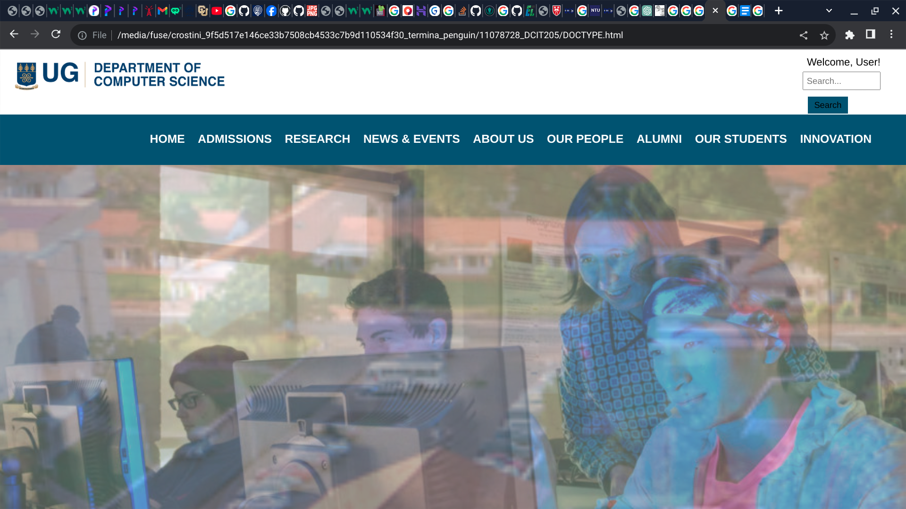
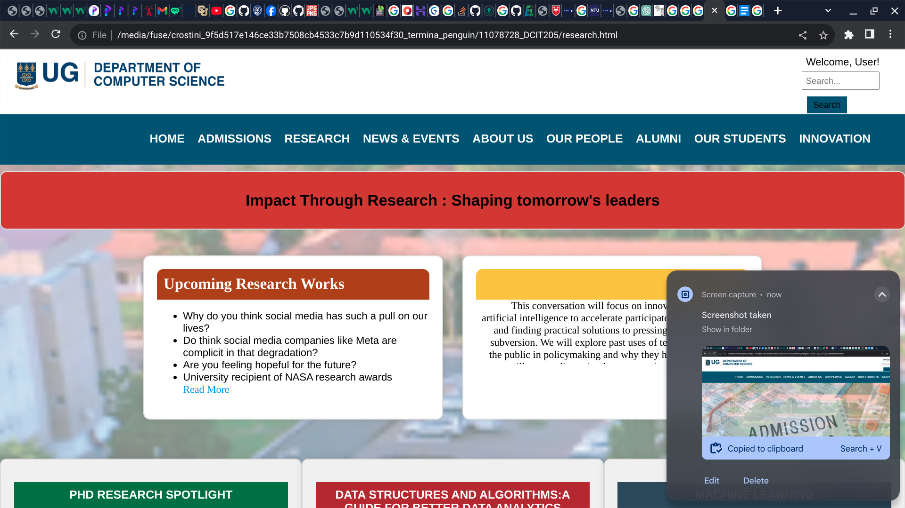
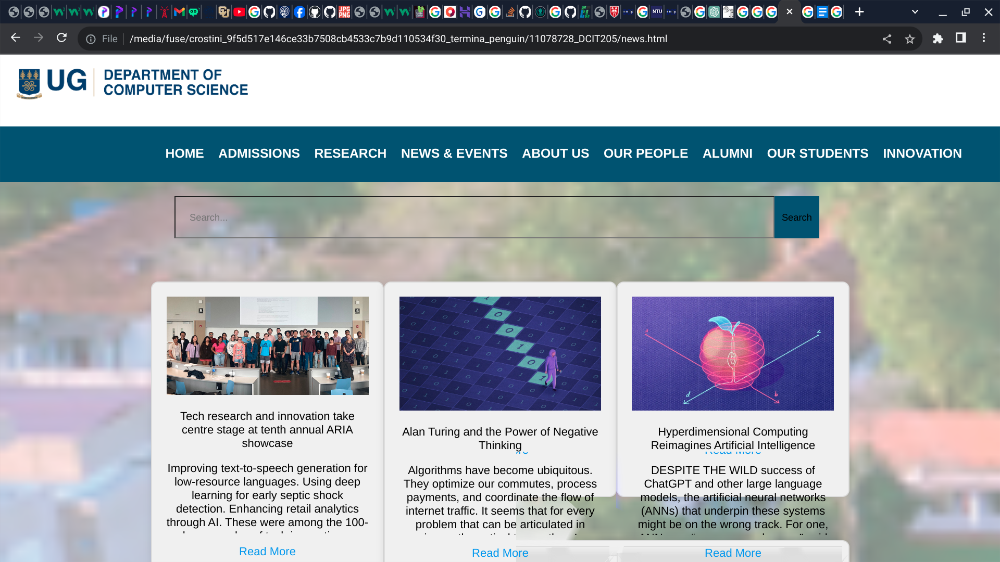
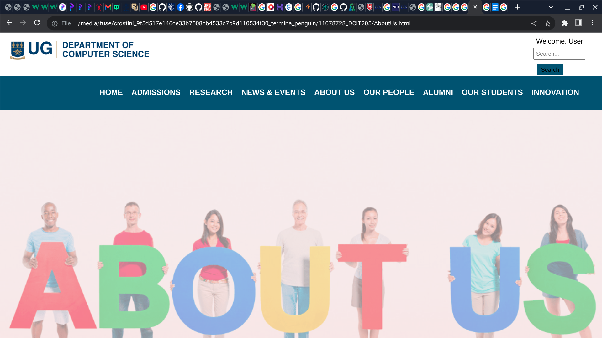
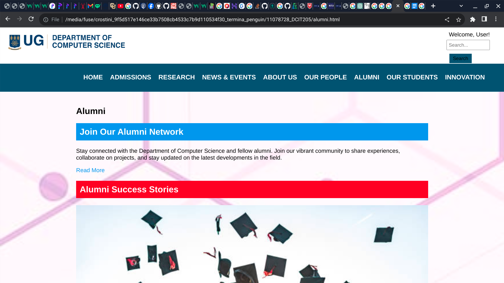
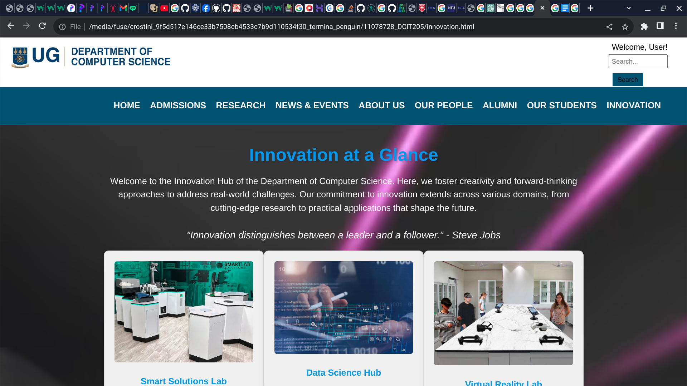
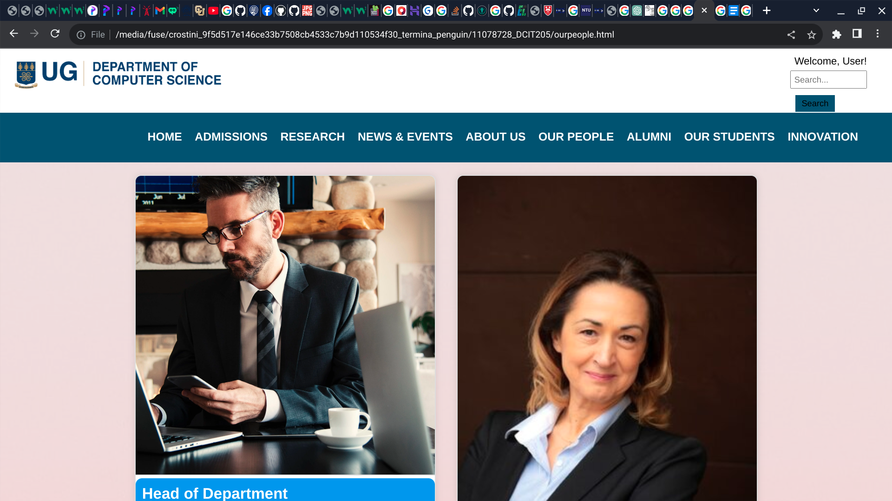

# DCIT_205_IA  STUDENT: 11078728 NAME: ARTHUR PRINCE NANA KWESI
# Computer Science Department Website

Welcome to the Computer Science Department's official website! 🚀 Explore the exciting world of computer science, innovation, research, and more with our user-friendly and visually appealing web pages.

## Table of Contents
1. [Introduction](#introduction)
2. [Features](#features)
3. [Pages Overview](#pages-overview)
4. [How to Use](#how-to-use)
5. [Customization](#customization)
6. [Contributing](#contributing)
7. [License](#license)

## Introduction
This website serves as the online hub for the Department of Computer Science, providing a seamless and engaging experience for visitors. From admissions information to groundbreaking research, each page is crafted with care and creativity to showcase the department's achievements and offerings.

## Features
- **Responsive Design:** The website is designed to be visually appealing and functional across various devices.
- **Innovative Layout:** Creative layouts and engaging content to captivate visitors.
- **Dynamic Slideshow:** Enjoy a dynamic slideshow on the homepage featuring captivating images.
- **Research Excellence:** Dive into the department's cutting-edge research initiatives.
- **People and Alumni Sections:** Learn more about the faculty, staff, and accomplished alumni.
- **Student Showcase:** Explore the achievements and projects of our talented students.
- **Innovation Page:** Discover the latest innovations and advancements in computer science.

## Pages Overview
1. **Home:** Navigate to the homepage for a quick overview of the department.
2. **Admissions:** Get information about admissions, courses, and the application process.
3. **Research:** Explore the department's research excellence and recent publications.
4. **News & Events:** Stay updated with the latest news and upcoming events.
5. **About Us:** Learn about the history, vision, and mission of the Computer Science Department.
6. **Alumni:** Connect with successful alumni and their contributions to the field.
7. **Our Students:** Discover the accomplishments and projects of our talented students.
8. **Innovation:** Explore the forefront of innovation in computer science.
9. **People:** Meet the leadership team and key individuals in the department.
10. **Contact:** Find contact information to reach out and connect with us.

## How to Use
1. Clone the repository: `git clone https://github.com/pkay28748/11078728_DCIT205.git`
2. Open the desired HTML file in your preferred web browser.
3. Explore different pages using the navigation menu.

## Customization
Feel free to customize the website to match your department's branding or add additional content. The CSS styles are well-organized, making it easy to modify colors, fonts, and layouts.

## Contributing
Contributions are welcome! If you have improvements or new features to suggest, please open an issue or submit a pull request.

## License
This project is licensed under the [UG License](LICENSE).

## Screenshots

### Homepage

### Admissions

### Research

### News & Events

### About Us

### Alumni

### Our Students

### Innovation

### People

### Contact

Happy exploring! 🌐✨
